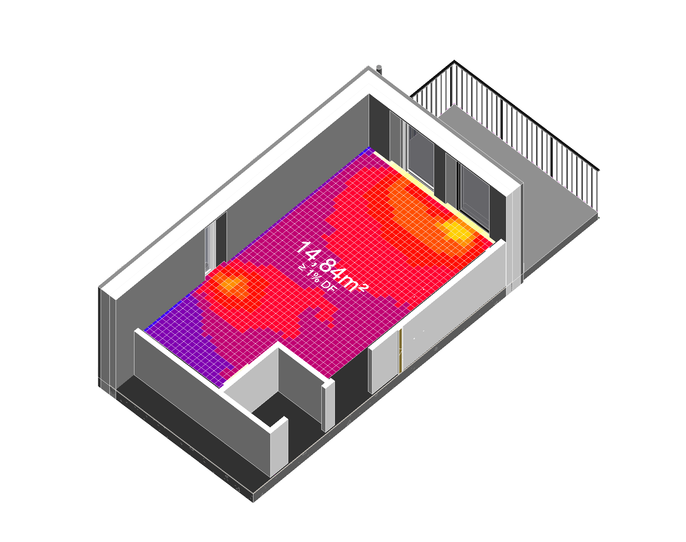
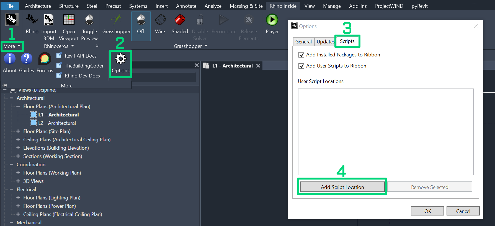

<!-- Improved compatibility of back to top link: See: https://github.com/othneildrew/Best-README-Template/pull/73 -->

<!--
*** Thanks for checking out the Best-README-Template. If you have a suggestion
*** that would make this better, please fork the repo and create a pull request
*** or simply open an issue with the tag "enhancement".
*** Don't forget to give the project a star!
*** Thanks again! Now go create something AMAZING! :D
-->

<!-- PROJECT SHIELDS -->
<!--
*** I'm using markdown "reference style" links for readability.
*** Reference links are enclosed in brackets [ ] instead of parentheses ( ).
*** See the bottom of this document for the declaration of the reference variables
*** for contributors-url, forks-url, etc. This is an optional, concise syntax you may use.
*** https://www.markdownguide.org/basic-syntax/#reference-style-links
-->
[![Contributors][contributors-shield]][contributors-url]
[![Forks][forks-shield]][forks-url]
[![Stargazers][stars-shield]][stars-url]
[![Issues][issues-shield]][issues-url]
[![Unlicense License][license-shield]][license-url]
[![LinkedIn][linkedin-shield]][linkedin-url]

Size of Dataset?
Imaging Libary needs to be installed? >YAK
License

<!-- PROJECT LOGO -->
 

  

  <h3 align="center">BelysningsStiftelsen_Daylightfactor</h3>

  

    ML-powered Revit plugin for fast, room-based daylight factor insights
     
    <a href="https://github.com/upskiller-xyz/BelysningsStiftelsen_Daylightfactor/wiki"><strong>Explore the docs »</strong></a>
     
     
    <a href="">View Demo</a>
    &middot;
    <a href="https://github.com/upskiller-xyz/BelysningsStiftelsen_Daylightfactor/issues/new?labels=bug">Report Bug</a>
    &middot;
    <a href="https://github.com/upskiller-xyz/BelysningsStiftelsen_Daylightfactor/issues/new?labels=enhancement">Request Feature</a>
  

<!-- TABLE OF CONTENTS -->

  
Table of Contents

  <ol>
    <li>
      <a href="#about-the-project">About The Project</a>
      <ul>
        <li><a href="#built-with">Built With</a></li>
      </ul>
    </li>
    <li>
      <a href="#getting-started">Getting Started</a>
      <ul>
        <li><a href="#prerequisites">Prerequisites</a></li>
        <li><a href="#installation">Installation</a></li>
      </ul>
    </li>
    <li><a href="#usage">Usage</a></li>
    <li><a href="#model-requirements--limitations">Model Requirements & Limitations</a></li>
    <li><a href="#contributing">Contributing</a></li>
    <li><a href="#license">License</a></li>
    <li><a href="#contact">Contact</a></li>
    <li><a href="#acknowledgments">Acknowledgments</a></li>
  </ol>

<!-- ABOUT THE PROJECT -->
## About The Project

  

This project was funded by [**Belysnings Stiftelsen**](https://belysningsstiftelsen.se/) and provides a practical solution for performing daylight analysis directly within Autodesk Revit. The plugin enables architects and planners to quickly assess whether a design meets daylight compliance requirements based on the **Daylight Factor** method as defined in **SS-EN 17037**. Unlike traditional simulation-based tools, this plugin leverages **machine learning** to deliver near-instant daylight insights with minimal setup, making it ideal for early-phase design evaluation.

How it works:  
The plugin uses **Rhino.Inside.Revit** to extract room geometries and generates a simplified representation. This data is then sent to a machine learning model that has been trained on over **12,000 daylight simulation scenarios** with varying geometries. Currently, analysis is performed on a **room-by-room basis**, allowing users to target individual spaces for compliance checking
(ML analysis runs on a local server, which you need to set up once). The resulting **heatmap** and derived metrics are visualized directly within Revit. 

### Built With

 

(<a href="#readme-top">back to top</a>)

<!-- GETTING STARTED -->
## Getting Started

### Prerequisites

This plugin has been tested with the following software versions. Other versions may work, but are not officially supported.

- [Autodesk Revit](https://www.autodesk.com/products/revit/overview) - Version 2024 or 2025
- [McNeel Rhino](https://www.rhino3d.com/) - Version 8
- [Rhino.Inside.Revit](https://www.rhino3d.com/inside/revit/) - Version 1.31
- [Grasshopper](https://www.grasshopper3d.com/) with the following plugins:
  - [Imaging Library by David Rutten (v1.0.4)]()
  - [Pufferfish by Michael Pryor (v3.0.0)](https://www.food4rhino.com/en/app/pufferfish)
  - [MeshEdit by [uto] (v2.0.0)](https://www.food4rhino.com/en/app/meshedit)

### Installation

  
<strong> 1. Plugin Installation in Revit</strong>

   
  Follow these steps to integrate the plugin into Revit via Rhino.Inside. Once completed, the plugin tools will appear as buttons within the **Rhino.Inside** tab in the Revit ribbon.

  *  **Download or clone** this repository  
  `git clone https://github.com/upskiller-xyz/BelysningsStiftelsen_Daylightfactor.git`
  * Open **Autodesk Revit** and switch to the **Rhino.Inside** tab
  * Expand the **More** dropdown (marked as [1] in the image below)
  * Select **Options** from the list ([2])
  * In the new dialog, switch to the **Scripts** tab ([3])
  * Click **Add Script Location** ([4]) and select the `revit_plugin` folder from the downloaded repository
  * Confirm with **OK** – the plugin buttons should now appear inside the **Rhino.Inside** ribbon

  

    
  

  
(<a href="#readme-top">back to top</a>)

  
<strong> 2. Setup of local server </strong>

  TBD

<!-- USAGE EXAMPLES -->
## Usage

The plugin provides three core functions accessible via buttons in the **Rhino.Inside** ribbon.

### Settings
Define daylight analysis parameters for the current project:
- Wall configuration (e.g., multi-layer vs. separate façade modeling)
- Transmission value (currently fixed at 70%)
- Ground level reference

Settings are stored locally and reused unless changed.

### Prepare 3D
Creates 3D views and parameters for simulation results.  
Optional but recommended. Only needs to be executed once per project.

### Analyze
Select a room in Revit and run the daylight analysis.  
A heatmap and metrics (e.g., daylight factor) are generated directly in Revit.  
Previous results are overwritten with each new analysis.

For a detailed explanation of each setting, see the [Usage Guide](https://github.com/yourname/yourrepo/wiki/Usage).

(<a href="#readme-top">back to top</a>)

<!-- MODEL REQUIREMENTS -->
## Model Requirements & Limitations

To ensure accurate daylight results, certain conditions must be met within the Revit model. For example:

- Project must use **millimeters** as unit
- Revit must be opened in **English localisation**
- Correct categorization of interior and exterior building parts

Also, limitations apply to group handling and bounding box approximations.

For a full list of requirements and current limitations, see the [Model Setup & Known Issues](./docs/model_requirements.md)

(<a href="#readme-top">back to top</a>)

<!-- CONTRIBUTING -->
## Contributing

Contributions are what make the open source community such an amazing place to learn, inspire, and create. Any contributions you make are **greatly appreciated**.

If you have a suggestion that would make this better, please fork the repo and create a pull request. You can also simply open an issue with the tag "enhancement".

1. Fork the Project
2. Create your Feature Branch (`git checkout -b feature/AmazingFeature`)
3. Commit your Changes (`git commit -m 'Add some AmazingFeature'`)
4. Push to the Branch (`git push origin feature/AmazingFeature`)
5. Open a Pull Request

### Top contributors:

(<a href="#readme-top">back to top</a>)

<!-- LICENSE -->
## License

TBD

(<a href="#readme-top">back to top</a>)

 
<!-- CONTACT -->
## Contact

For questions, collaboration inquiries or feedback, feel free to reach out:

Alejandro Pachecho - Project Lead: [alejandro.pacheco@upskiller.xyz](mailto:alejandro.pacheco@upskiller.xyz)  
Christoph Berkmiller - BIM & Integration: [christoph.berkmiller@upskiller.xyz](christoph.berkmiller@upskiller.xyz)  
Libny Pacheco - BIM & Integration: [libny.pacheco@upskiller.xyz](libny.pacheco@upskiller.xyz)  
Stasja Fedorova – Machine Learning & Backend: [stasja.fedorova@upskiller.xyz](stasja.fedorova@upskiller.xyz)  

Project Repository: [github.com/upskiller-xyz/BelysningsStiftelsen_Daylightfactor](https://github.com/upskiller-xyz/BelysningsStiftelsen_Daylightfactor)

(<a href="#readme-top">back to top</a>)

<!-- ACKNOWLEDGMENTS -->
## Acknowledgments

Special thanks to the following people and tools that supported this project:

* [Belysningsstiftelsen](https://belysningsstiftelsen.se/) – for funding and support
* [Best-README-Template](https://github.com/othneildrew/Best-README-Template) – for the excellent README structure

(<a href="#readme-top">back to top</a>)

<!-- MARKDOWN LINKS & IMAGES -->
<!-- https://www.markdownguide.org/basic-syntax/#reference-style-links -->
[contributors-shield]: https://img.shields.io/github/contributors/upskiller-xyz/BelysningsStiftelsen_Daylightfactor.svg?style=for-the-badge
[contributors-url]: https://github.com/upskiller-xyz/BelysningsStiftelsen_Daylightfactor/graphs/contributors
[forks-shield]: https://img.shields.io/github/forks/upskiller-xyz/BelysningsStiftelsen_Daylightfactor.svg?style=for-the-badge
[forks-url]: https://github.com/upskiller-xyz/BelysningsStiftelsen_Daylightfactor/network/members
[stars-shield]: https://img.shields.io/github/stars/upskiller-xyz/BelysningsStiftelsen_Daylightfactor.svg?style=for-the-badge
[stars-url]: https://github.com/upskiller-xyz/BelysningsStiftelsen_Daylightfactor/stargazers
[issues-shield]: https://img.shields.io/github/issues/upskiller-xyz/BelysningsStiftelsen_Daylightfactor.svg?style=for-the-badge
[issues-url]: https://github.com/upskiller-xyz/BelysningsStiftelsen_Daylightfactor/issues
[license-shield]: https://img.shields.io/github/license/upskiller-xyz/BelysningsStiftelsen_Daylightfactor.svg?style=for-the-badge
[license-url]: https://github.com/upskiller-xyz/BelysningsStiftelsen_Daylightfactor/blob/main/LICENSE
[linkedin-shield]: https://img.shields.io/badge/-LinkedIn-black.svg?style=for-the-badge&logo=linkedin&colorB=555
[linkedin-url]: https://www.linkedin.com/company/upskiller-xyz
